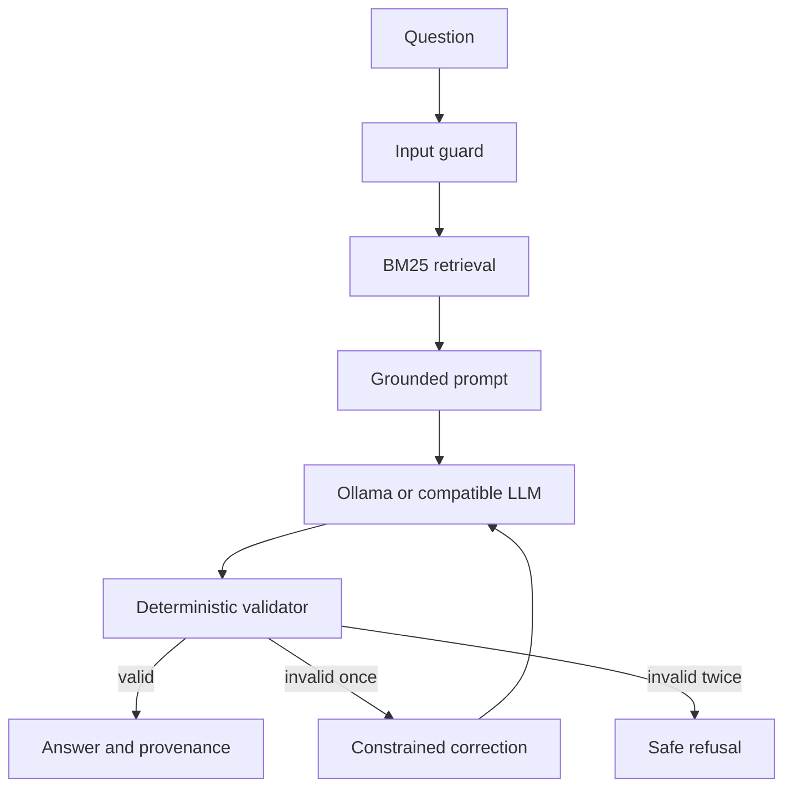

# UK Retrofit LLM/RAG Assistant

[](https://github.com/noumansameer789/uk-retrofit-rag-assistant/actions/workflows/ci.yml)
[](LICENSE)

A citation-first LLM application over allowlisted official UK home-energy guidance. It uses
deterministic BM25 retrieval, a local Ollama or OpenAI-compatible model, and deterministic
post-generation controls. An answer is released only when its JSON, citations and factual
sentences satisfy the grounding contract.

This is an independently built portfolio system, not an eligibility calculator or a replacement
for current instructions from the cited authority.

## What this project demonstrates

- FastAPI `POST /ask`, liveness `/health` and model-aware readiness `/ready`
- zero-key Docker Compose stack that provisions Ollama and the pinned local model automatically
- swappable Ollama and OpenAI-compatible adapters with bounded HTTP responses
- reproducible official-source ingestion with hostname, redirect, content-type and size controls
- source freshness, stable IDs and SHA-256 evidence digests returned with citations
- deterministic Okapi BM25 retrieval and a transparent labelled retrieval evaluation
- untrusted-context prompt construction and Unicode-canonicalised injection screening
- exact JSON-field, sentence-level citation and unsafe-eligibility-claim validation
- one constrained model-output repair attempt, followed by safe refusal
- non-root, read-only API container plus CI linting, tests and dependency auditing

## Architecture



## Quick start: no key and no host Ollama

The only host prerequisite is Docker with Compose and sufficient local disk/RAM. No external
credential, paid API, host Ollama installation or pre-downloaded model is required.

```bash
docker compose up --build
```

Compose starts the pinned Ollama image, pulls `llama3.2:3b-instruct-q4_K_M` into the persistent
`ollama_models` volume, waits for that exact model, and then marks the API ready. The first start
downloads roughly 2 GB of model weights. CPU inference is supported but slower than GPU inference.

Open `http://localhost:8000/docs`, check readiness, and ask a grounded question:

```bash
curl -s http://localhost:8000/ready
curl -s http://localhost:8000/ask \
  -H 'Content-Type: application/json' \
  -d '{"question":"Who applies for a Boiler Upgrade Scheme grant?","top_k":3}'
```

Run a real model-to-API smoke check from a clean stack:

```bash
docker compose --profile smoke up --build \
  --abort-on-container-exit --exit-code-from smoke
docker compose --profile smoke down
```

Use `docker compose down` to stop the normal stack. Add `--volumes` only when intentionally
deleting the downloaded model.

## API contract

An answered response includes both human-readable markers and machine-auditable provenance:

```json
{
  "status": "answered",
  "answer": "Installers apply on behalf of property owners [1].",
  "citations": [
    {
      "id": 1,
      "title": "Boiler Upgrade Scheme",
      "url": "https://www.gov.uk/apply-boiler-upgrade-scheme",
      "score": 1.234567,
      "source_id": "govuk-boiler-upgrade-scheme",
      "checked_at": "2026-09-01",
      "content_sha256": "deacebf484be1aba926dda139f73c96b1144baf66b187aa70d5235982ce4b384"
    }
  ],
  "refusal_reason": null
}
```

Unsupported, injection-like or personal eligibility questions return `status: "refused"` without
calling the model where possible. Provider failures return HTTP 502; missing configuration and
failed readiness return HTTP 503.

## Evidence and ingestion

`data/sources.json` is the explicit GOV.UK/Ofgem allowlist. The committed `data/guidance.json`
contains short project-authored synopses for deterministic review and CI. To create fresh local
chunks from the live official pages:

```bash
PYTHONPATH=src python -m retrofit_rag.ingestion
PYTHONPATH=src python -m retrofit_rag.app \
  --catalogue data/generated/guidance.json "heat pump grant"
```

The ingestion path rejects non-HTTPS or non-allowlisted hosts, off-list redirects before follow,
non-HTML responses and pages above 2 MB. It strips navigation/scripts, chunks deterministically,
and hashes the exact normalised evidence. Generated data is ignored by Git so a human must review
source changes before promotion. See [`data/README.md`](data/README.md).

## Manual provider configuration

For a non-Compose setup, install the exact runtime lock and start the API:

```bash
python -m venv .venv
source .venv/bin/activate
python -m pip install -r requirements.lock
uvicorn retrofit_rag.api:app --app-dir src --host 0.0.0.0 --port 8000
```

Local Ollama:

```bash
export LLM_PROVIDER=ollama
export OLLAMA_MODEL="llama3.2:3b-instruct-q4_K_M"
export OLLAMA_BASE_URL="http://localhost:11434"
```

OpenAI-compatible endpoint:

```bash
export LLM_PROVIDER=openai
export OPENAI_API_KEY="your-runtime-secret"
export OPENAI_MODEL="a-model-available-to-your-account"
export OPENAI_BASE_URL="https://your-compatible-host/v1"
```

The default local path does not use `OPENAI_API_KEY`. `.env` is ignored by Git.

## Retrieval inspection, evaluation and tests

Retrieval can be inspected without any model:

```bash
PYTHONPATH=src python -m retrofit_rag.app "heat pump grant"
```

Run the same local quality gates used by CI:

```bash
python -m pip install -r requirements.lock -r requirements-dev.txt
ruff check .
python -m compileall -q src scripts
pip-audit -r requirements.lock
PYTHONPATH=src python -m unittest discover -s tests -v
PYTHONPATH=src python -m retrofit_rag.evaluation \
  --min-hit-rate 1 --min-mrr 1 --min-abstention 1
docker compose config --quiet
```

The committed 12-question retrieval set contains eight answerable and four deliberately unrelated
questions. CI currently requires hit-rate@3, mean reciprocal rank and abstention accuracy of 1.0.
This small contract set detects regressions; it is not evidence of production accuracy. Provider
and API tests are mocked, so CI publishes no key and does not call a paid model.

## Security boundaries and honest limitations

- Questions and retrieved text are both treated as untrusted; known injection forms are blocked.
- Every factual sentence needs an allowed source marker, and JSON citations must match those markers.
- Personal eligibility decisions and guaranteed-funding claims are rejected.
- A citation proves which project evidence was used, not that the model interpreted it correctly.
- Pattern controls cannot recognise every novel injection, and a small local model can still refuse
  a supported question after its single repair attempt.
- This repository has no public deployment, scheduled crawler, user authentication, rate limiter,
  monitoring or expert red-team sign-off.

See [`docs/THREAT_MODEL.md`](docs/THREAT_MODEL.md) for trust boundaries, abuse cases, residual risks
and the controls a real public deployment would still require. Vulnerabilities should be reported
according to [`SECURITY.md`](SECURITY.md).

## Licence

Original project code and documentation are MIT licensed. Official source pages and separately
downloaded model weights retain their own terms; see [`data/README.md`](data/README.md).
