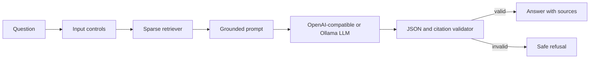

# UK Retrofit LLM/RAG Assistant

A citation-first LLM application over curated official UK home-energy guidance. It combines deterministic sparse retrieval with either an OpenAI-compatible chat endpoint or a local Ollama model, then rejects outputs that fail a strict grounding contract.

This is an independently built portfolio system. It is not an eligibility calculator and does not replace current guidance from the linked authorities.

## Why this is a genuine LLM/RAG build

- pluggable OpenAI-compatible and Ollama chat adapters
- FastAPI `POST /ask` endpoint with typed request and response models
- retrieved evidence inserted into an explicit untrusted-context boundary
- JSON generation contract with sentence-level citation enforcement
- abstention for unsupported questions, unsafe eligibility decisions and prompt injection
- retrieved-context injection screening and invalid-citation rejection
- labelled retrieval evaluation with hit-rate, MRR and abstention metrics
- mocked provider/API tests: CI never needs an API key or live model
- one-command local stack that provisions Ollama and downloads the model automatically
- Docker packaging and GitHub Actions validation

## Architecture



## API

### Zero-key local launch

The default path needs no API key and no Ollama installation on the host. Docker Compose starts a pinned Ollama container, downloads the pinned `llama3.2:3b-instruct-q4_K_M` model into a persistent volume, waits for it, and then starts the API:

```bash
docker compose up --build
```

When the API is healthy, open `http://localhost:8000/docs` or call:

```bash
curl -s http://localhost:8000/ask \
  -H 'Content-Type: application/json' \
  -d '{"question":"Who applies for a Boiler Upgrade Scheme grant?","top_k":3}'
```

The first launch downloads the container image and roughly 2 GB model. Later launches reuse the `ollama_models` volume. CPU inference works but is slower than GPU inference. Stop the services with `docker compose down`; add `--volumes` only when you intentionally want to delete the downloaded model.

### Manual provider configuration

Install and start the service:

```bash
python -m venv .venv
source .venv/bin/activate
python -m pip install -r requirements.txt
uvicorn retrofit_rag.api:app --app-dir src --host 0.0.0.0 --port 8000
```

Configure one provider before starting it.

OpenAI-compatible endpoint:

```bash
export LLM_PROVIDER=openai
export OPENAI_API_KEY="your-runtime-secret"
export OPENAI_MODEL="a-model-available-to-your-account"
# Optional: export OPENAI_BASE_URL="https://your-compatible-host/v1"
```

Local Ollama:

```bash
export LLM_PROVIDER=ollama
export OLLAMA_MODEL="your-installed-model"
# Optional: export OLLAMA_BASE_URL="http://localhost:11434"
```

Ask a question:

```bash
curl -s http://localhost:8000/ask \
  -H 'Content-Type: application/json' \
  -d '{"question":"Who applies for a Boiler Upgrade Scheme grant?","top_k":3}'
```

Response contract:

```json
{
  "status": "answered",
  "answer": "Installers apply on behalf of property owners [1].",
  "citations": [
    {
      "id": 1,
      "title": "Boiler Upgrade Scheme",
      "url": "https://www.gov.uk/apply-boiler-upgrade-scheme",
      "score": 0.123456
    }
  ],
  "refusal_reason": null
}
```

## CLI

Retrieval-only inspection is deliberately available without a model:

```bash
PYTHONPATH=src python -m retrofit_rag.app "heat pump grant"
```

Use a configured model:

```bash
PYTHONPATH=src python -m retrofit_rag.app \
  "Who applies for the Boiler Upgrade Scheme?" --provider openai
```

## Evaluation and tests

The committed six-question smoke set contains four answerable and two deliberately unanswerable questions. It is a contract test, not evidence of production accuracy.

```bash
PYTHONPATH=src python -m retrofit_rag.evaluation
python -m unittest discover -s tests -v
```

The evaluation reports `hit_rate_at_k`, `mean_reciprocal_rank` and `abstention_accuracy`. CI requires all three to remain at `1.0` on this small labelled set.

## Safety boundaries

- API keys are read only from runtime environment variables and `.env` is ignored.
- Questions attempting instruction override, prompt disclosure or secret extraction are refused before generation.
- Personal eligibility or guaranteed-funding decisions are refused.
- Retrieved text containing instruction-injection patterns is discarded.
- Every factual sentence must contain a valid source marker, and the JSON citation list must match those markers.
- A valid citation proves provenance, not that the source is still current; production deployment would need scheduled crawling, versioning, freshness alerts and a substantially larger expert-labelled evaluation set.

## Docker

The recommended no-key path is `docker compose up --build`. To run only the API container against an already configured provider:

```bash
docker build -t retrofit-rag .
docker run --rm -p 8000:8000 \
  -e LLM_PROVIDER \
  -e OPENAI_API_KEY \
  -e OPENAI_MODEL \
  retrofit-rag
```
